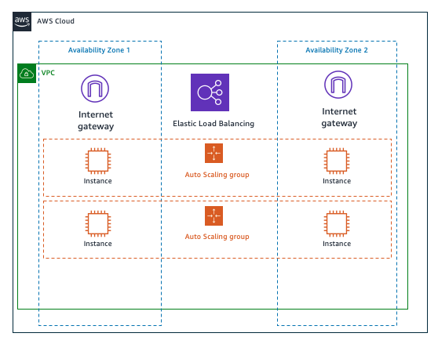

# Infraestrutura na AWS

### Objetivo 

Esta apresentação teve como objetivo explicar os principais serviços da AWS: 

- EC2
- RDS
- VPC
- Organizations 

### Demonstração 

Uma demonstração foi feita utilizando os serviços de Infraestrutura VPC e EC2, com Load Balancer e Autoscalling.

### Resultados esperados 

Aplicação Hello World rodando na arquitetura demonstrada. 

### TDB

Cloudformation para deploy

